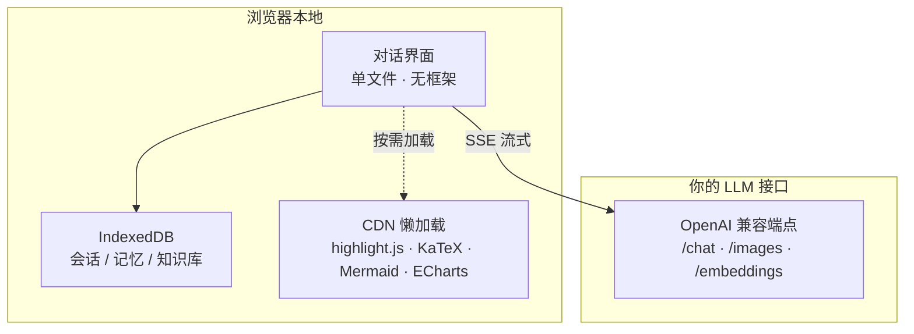

<div align="center">
  <h1>AI 对话助手</h1>
  <p>单文件纯前端 · 双击即用 · 数据不出本机 · 兼容所有 OpenAI 接口</p>
  
  
  
  
  <br />
  <p>
    <a href="https://github.com/X33834/ai-chat-assistant">GitHub</a> ·
    <a href="https://gitcode.com/badhope/ai-chat-assistant">GitCode</a> ·
    <a href="https://gitee.com/badhope/ai-chat-assistant">Gitee</a>
  </p>
</div>

---

## 架构图



---

## 快速开始

浏览器直接打开 `AI对话助手.html`，无需 Node、无需构建、无需后端。

1. 侧边栏底部「接口设置」（快捷键 Ctrl/⌘+S）
2. 选择预设供应商 或 填写自定义 Base URL + API Key
3. 保存，开始对话

**内置预设**：DeepSeek · OpenAI · Kimi · 通义千问 · 智谱 GLM · 豆包 · Agnes AI · 自定义

---

## 功能总览

| 模块 | 说明 |
|------|------|
| **对话核心** | 多轮流式、消息编辑/删除/引用/重生成、富文本复制、语音朗读 |
| **多模态** | 图片上传（最多 4 张）+ 图像生成（可配置独立模型） |
| **RAG 知识库** | 文档自动分块，BM25 + 向量嵌入混合检索，纯本地 |
| **长期记忆** | 对话后自动提取用户事实，支持手动管理 |
| **Agent 循环** | 模型多轮工具调用（最多 5 轮），内置时间/计算器工具 |
| **联网搜索** | 自动适配 GLM / 通义 / OpenAI / Kimi，不支持时降级 |
| **快捷工作流** | 3 个预设多步链式提示词，支持自定义新建 |
| **CSV 分析** | 上传 CSV 自动出 ECharts 图表 |
| **多模型对比** | 2–3 列并发提问，逐列流式输出 |
| **命令面板** | Ctrl/⌘+K，快速操作 + 会话/消息全文搜索 |
| **数据管理** | 全量 JSON 导出/导入，API Key 可选 AES-GCM 加密存储 |

---

## 技术栈

原生 HTML5 / CSS3 / JavaScript（ES2020+），无框架、无构建。
第三方库（highlight.js、KaTeX、Mermaid、ECharts、PapaParse 等）全部通过 jsDelivr CDN 懒加载，加载失败自动降级，不影响核心对话。

---

## 项目结构

```
ai-chat/
├── AI对话助手.html    # 全部功能在此（单文件）
├── LICENSE            # MIT
└── README.md
```

---

## License

[MIT](LICENSE)
